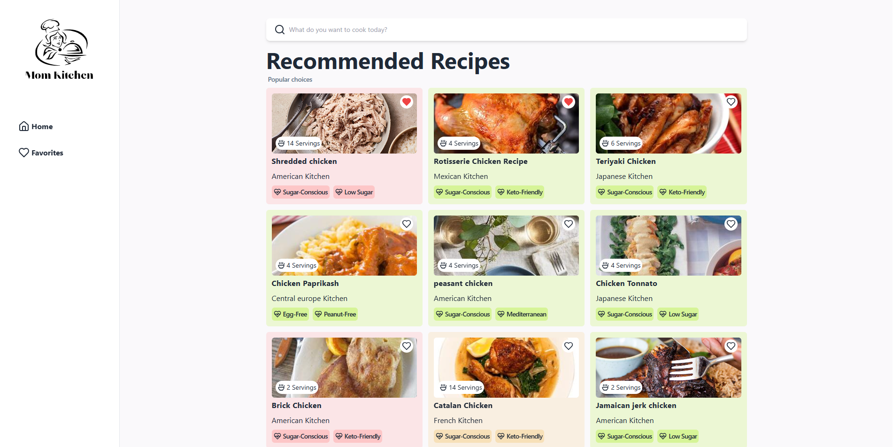

# Run Locally

### Setup .env file

```js
VITE_APP_ID = your_edamam_app_id;
VITE_APP_KEY = your_edamam_app_key;
```

### Install dependencies

```shell
npm install
```

### Start the app

```shell
npm run dev
```
